# 3D打印流程
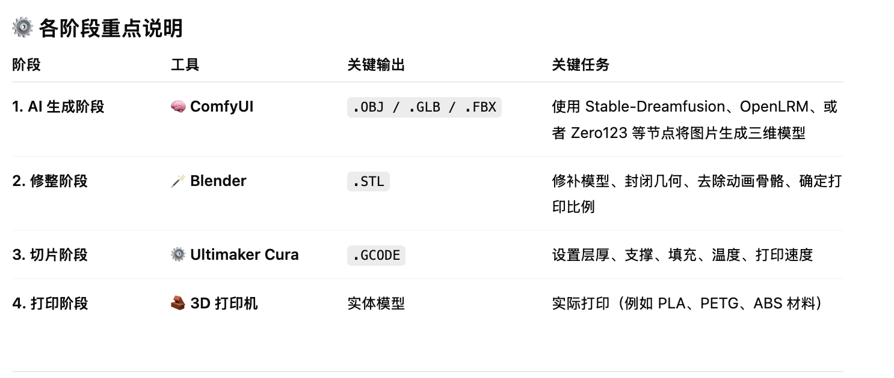

# 文件类型

- .GLB 或 .FBX：它们可以将贴图、材质、网格一起打包到单一文件中（更方便传输与共享）
- .OBJ 更像是一个“组合包”，要和 .MTL 与 .PNG 一起才能显示完整效果
- .stl 文件只保存了模型的几何信息（即三维形状表面三角面片），不包含颜色、贴图或材质信息。 所以常见的桌面 FDM 打印机读取 .stl 时，只能打印单一颜色的塑料丝（PLA、ABS 等）。

# 彩色打印

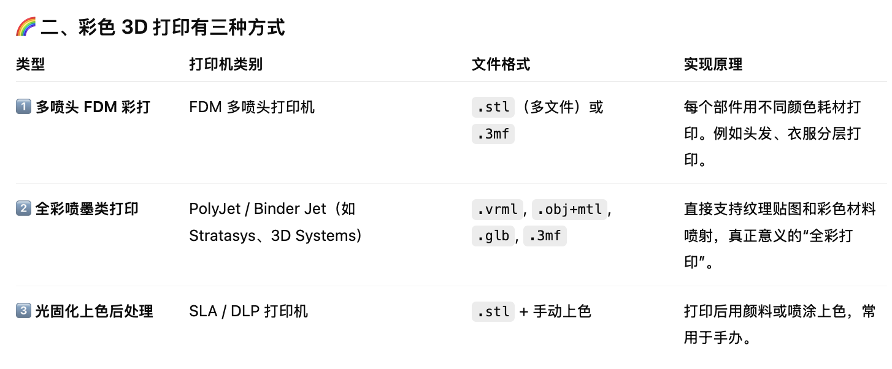

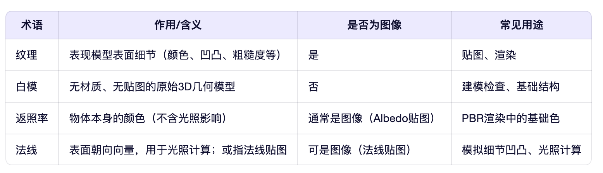

# ComfyUI

## 本地部署

- http://172.16.2.xx:8188/

## 安装ComfyUI管理器: 
- (ComfyUI) double@CP-001:~/vsproject/ComfyUI/custom_nodes$ git clone https://github.com/ltdrdata/ComfyUI-Manager.git
- 安装后重启在主界面右上会出现一个管理器的图标
  

## 在ComfyUI 中使用Hunyuan3D

- 参考其中的说明: https://docs.comfy.org/tutorials/3d/hunyuan3D-2
- download 图片 -> ComfyUI -> workflow -> open -> 加载图片 -> 生成工作流
- wget "https://huggingface.co/tencent/Hunyuan3D-2mv/resolve/main/hunyuan3d-dit-v2-mv/model.fp16.safetensors?download=true" -O ~/vsproject/ComfyUI/models/checkpoints/hunyuan3d-dit-v2-mv.safetensors  

- 工作流位于: /home/double/vsproject/ComfyUI/user/default/workflows

## 已内置hunyuan3d-v2.1

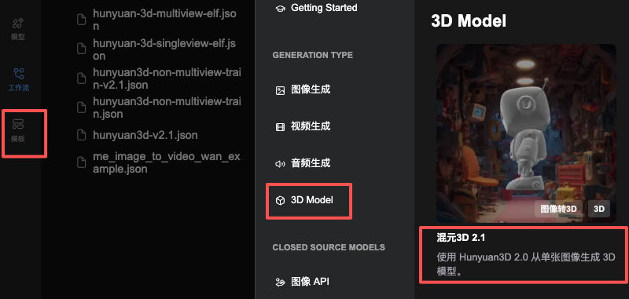

# Hunyuan3D

## 在线
- 在线生成: https://3d.hunyuan.tencent.com/
- 效果好不少, 用的是v3.0, 效果比较好, 可能比开放出来的最高v2.1好
- 调用生成3D白膜，一次20积分，2元
- 目前效果看没必要自己部署
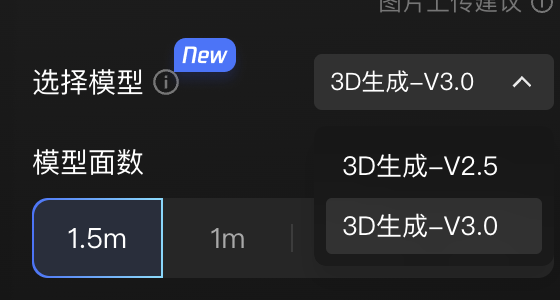
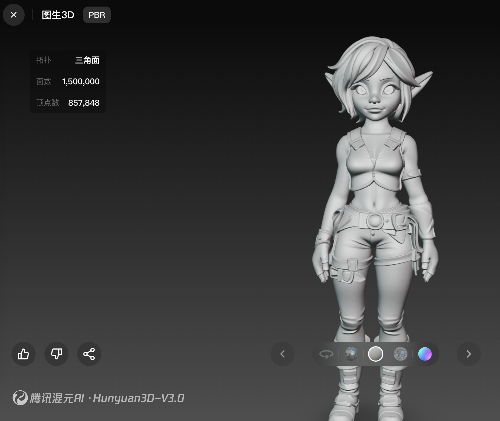

# v2.0
1. hunyuan3d-v2.0 multi-view 生成的不光滑

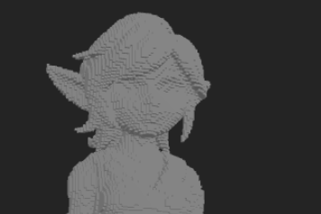

2. hunyuan3d-v2.0最大选择500000面，tree 512，效果好一些
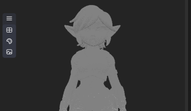

## v2.1

- https://github.com/comfyanonymous/ComfyUI/pull/8714 (重点看这个pull)
- hunayuan3d-v2.1效果好不少，基本可用

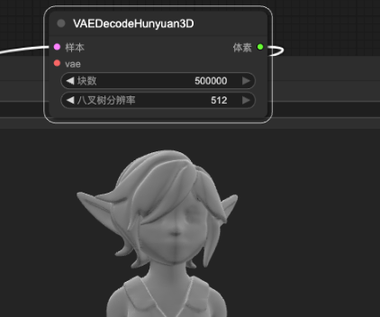

- 存在部分图像生成为正文体的情况

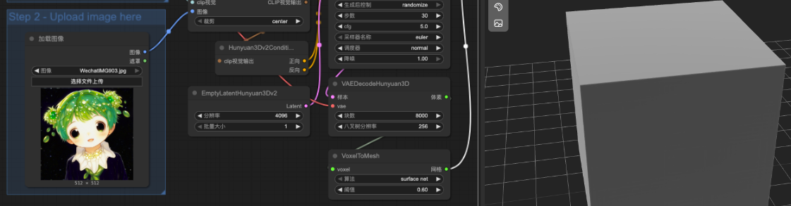

# TripoSR

- https://github.com/VAST-AI-Research/TripoSR

- 由Stability AI 发布
- 网站中也要收费

# Trellis-3D

# Seed3D 1.0 （ByteDance）

- 先不考虑，没有开源
- 在结测试很慢，一直没有回复

# Unique3D

# 结论
- 照片 -> Q图，效果比较好

# taobao

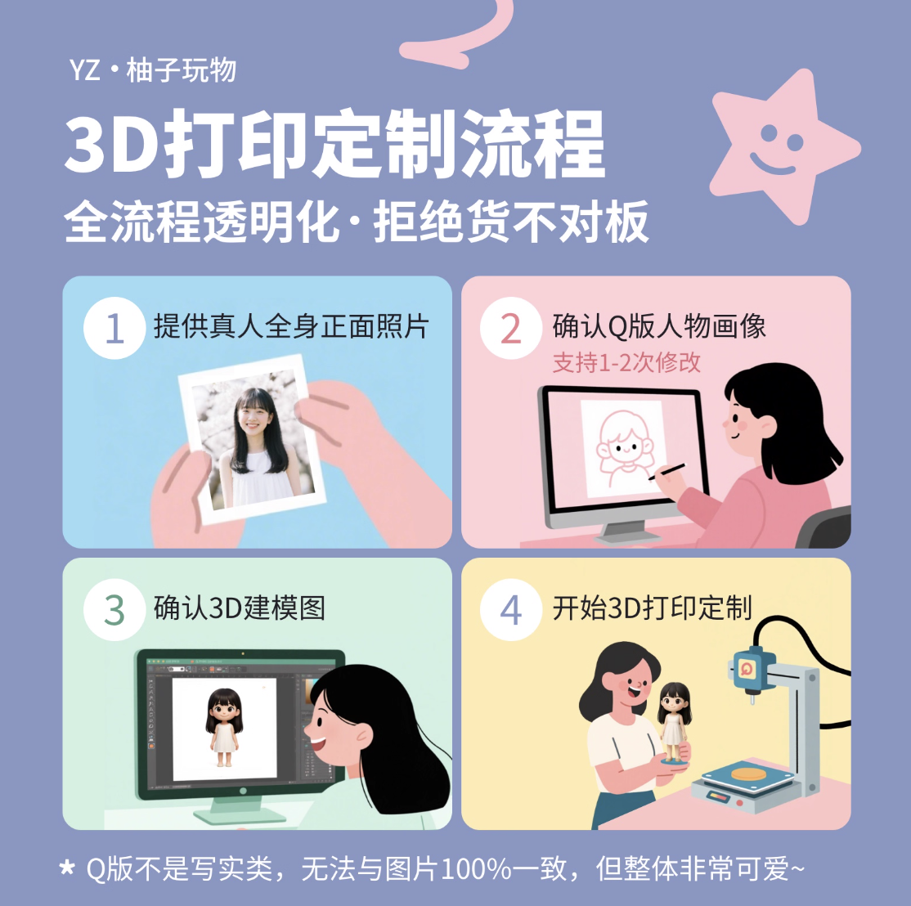

# xiaohongshu / 豆包

参考我发给你的照片形象, 创建 1 张真实风格的手办盲盒泡罩式包装照片, 画面完整展示整个精美包装。包装比例是: 2:3, 包装采用泡罩式结构, 由以下部分组成: 白色卡纸底板 (顶部设有挂钩) 和透明塑料泡罩。泡罩罩住人物和配件, 其中包含 1 个精致的 3D 打印人物 (人物表情特征要参考图片) 和 3 个角色中的穿搭配件, 人物摆放在左侧较大区域, 右侧分隔为 3 个小格, 整齐摆放 3 件配件。人物风格为 Q 版卡通, 手办盲盒玩具。角色可爱, 脸圆, 大眼睛, 整体风格像潮玩模型展示。人物细节要精致, 要有参考图形象的特征, 质感像 3D 打印玩偶。底板顶部写着标题文字 “TREASURE”, 右上角小字写着 “designed by SY”。包装参考照片的配色。画面背景是照片的场景。比例「2:3」

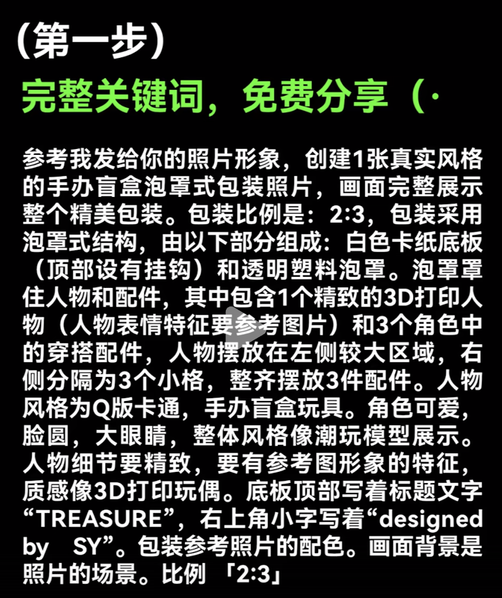

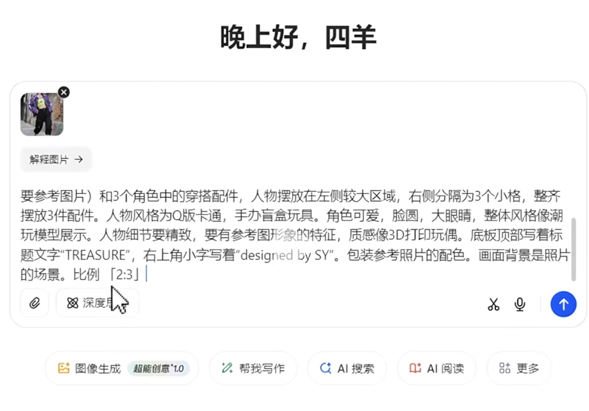

# todo

1. hunyuan3d-v2.1 multiview
2. 图片Q化
3. 是否可以在Blender中做光滑处理
4. 要去除背景
5. 脸部扣除，保留身体，在blender 中将脸部补上去
